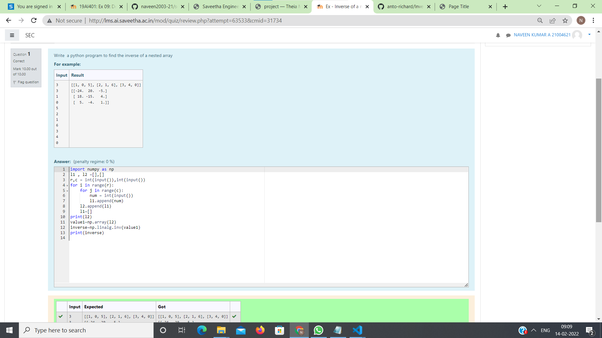

# Inverse-of-matrix

## AIM:
To write a program to perform Inverse-of-matrix using python programming.

## ALGORITHM:
### Step 1:
Import Numpy module as np.
### Step 2:
Create empty lists.
### Step 3:
Get input from the user for number of rows and columns.
### Step 4:
Use nested lists to append list.
### Step 5:
Print the inverse of the array using np.linalg.inv 

## PROGRAM:
```
## Delevoped by: A NAVEEN KUMAR
## Register no:212221240032
import numpy as np
l1 , l2 =[],[]
r,c = int(input()),int(input())
for i in range(r):
    for j in range(c):
        num = int(input())
        l1.append(num)
    l2.append(l1)
    l1=[]
print(l2)
value1=np.array(l2)
inverse=np.linalg.inv(value1)
print(inverse)
```
## OUTPUT:

## RESULT:
Thus the program is written to perform Inverse-of-matrix using python programming.